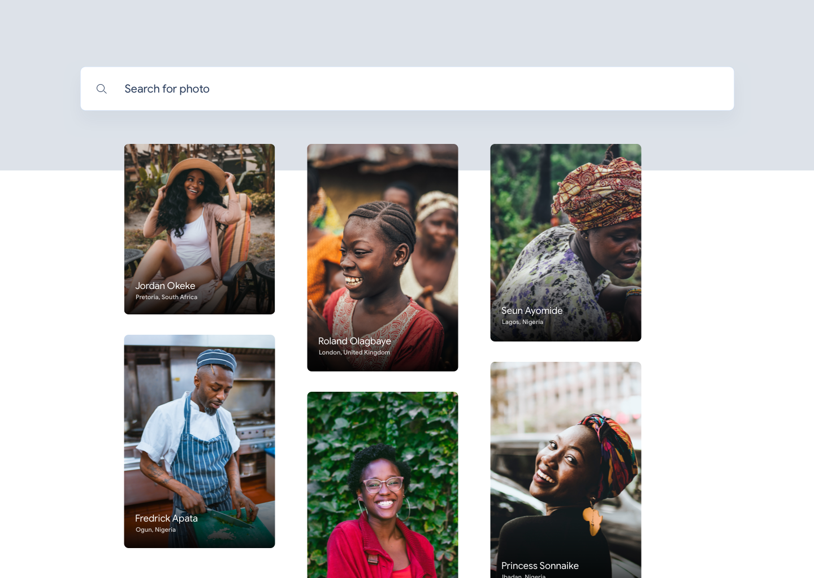
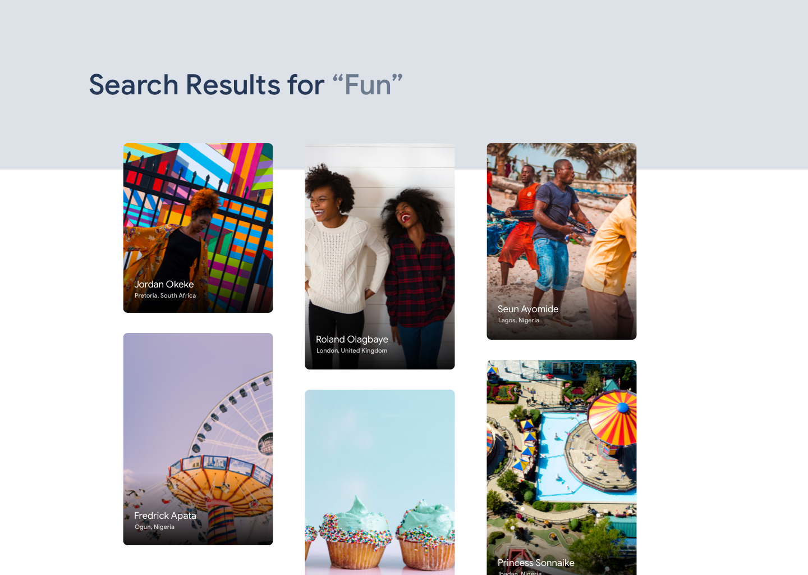
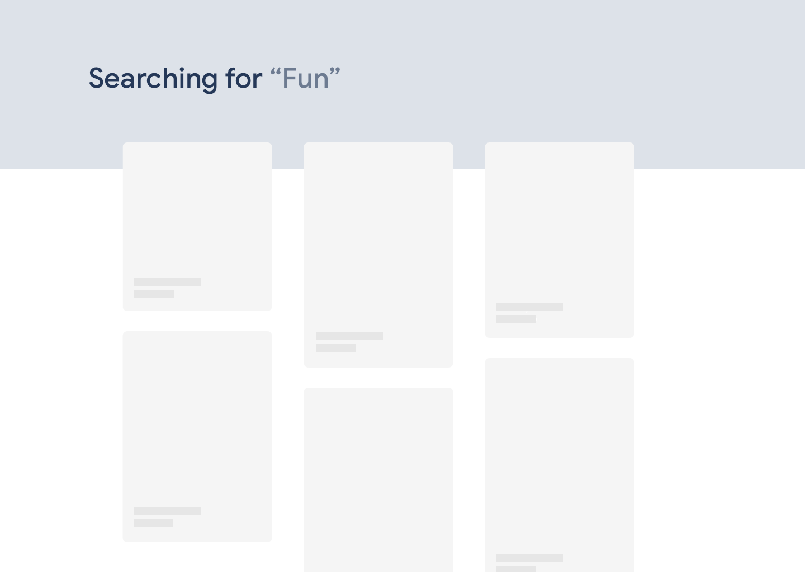

This project was bootstrapped with [Create React App](https://github.com/facebook/create-react-app).

## Unsplash Clone Application

This is a mini Unsplash Clone Application

### 1. Landing Screen: Shows 7 - 8 latest "African" photos from the API

### 2. Search Results Screen:

### 3. Loading Placeholders:

### `yarn start:dev`

1.  Fork and pull the master branch.
2.  Register on unsplash.com/developer to obtain your client_id

Runs the app in the development mode. 
Open [http://localhost:3000](http://localhost:3000) to view it in the browser.

The page will reload if you make edits. 
You will also see any lint errors in the console.
